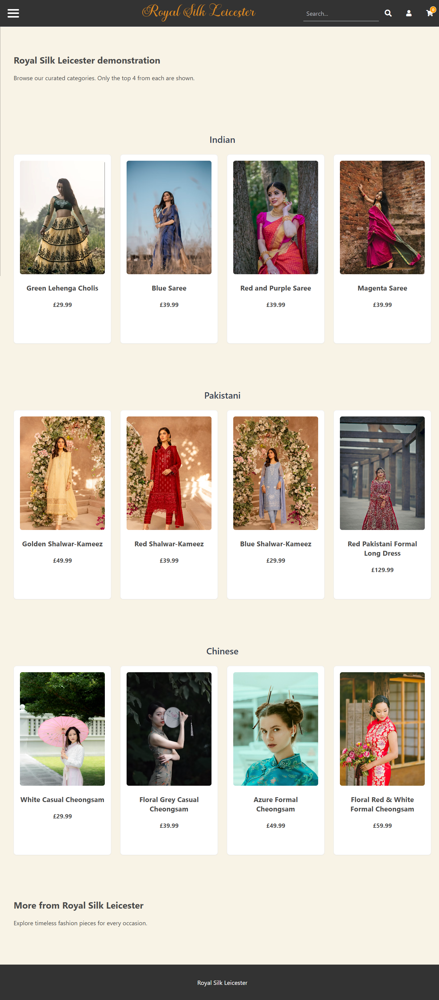
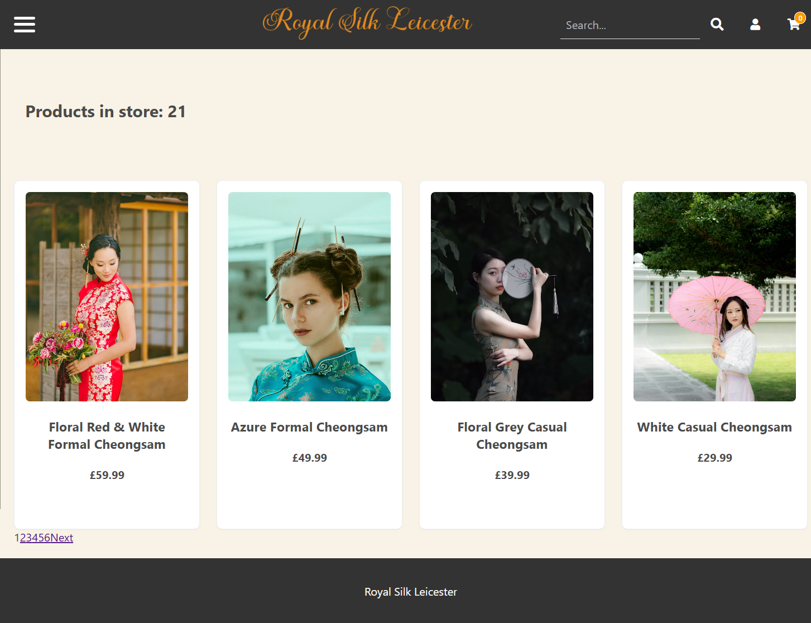
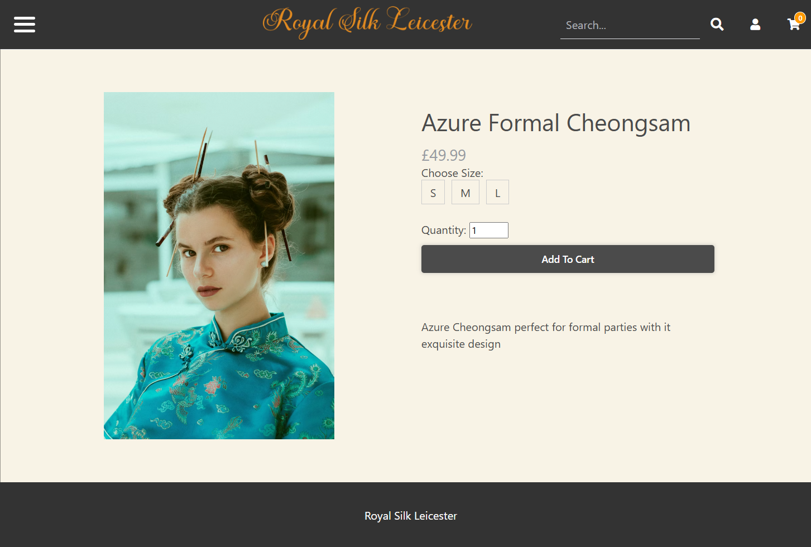
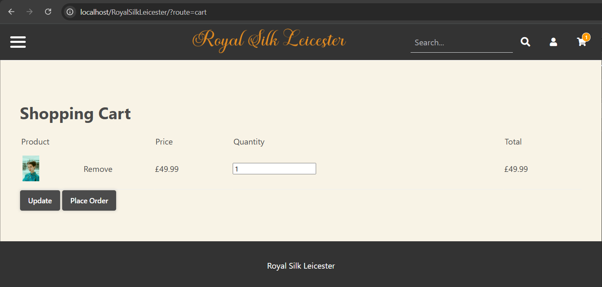
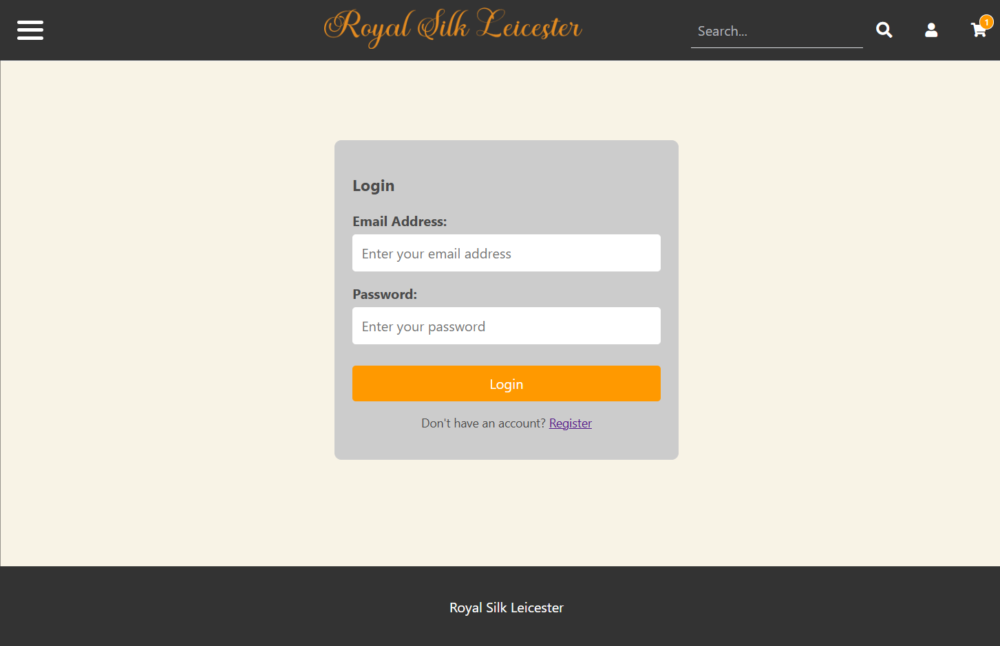
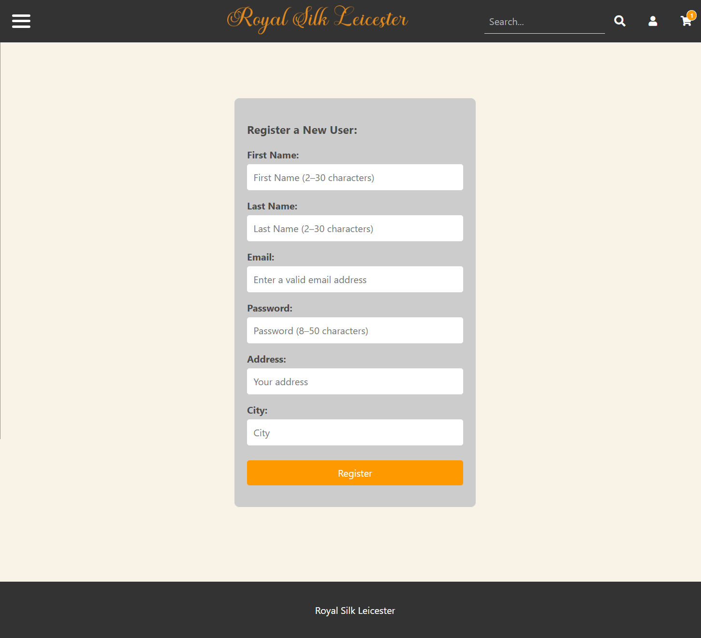

# E-Commerce-Website-for-Women-Clothing

A full-stack e-commerce web application built as part of my **BSc Computer Science final-year project** at De Montfort University.  
The website is designed to provide a **culturally relevant shopping experience** for Asian women in Leicester, supporting local retailers with an accessible, database-driven platform.  

---

## 🚀 Features  

- **User Registration & Authentication** – Secure account creation, login, and logout with password hashing (bcrypt).  
- **Product Catalogue** – Browse traditional and modern Asian clothing with pagination.  
- **Single Product Pages** – Detailed product descriptions with size and stock availability.  
- **Shopping Cart** – Add, update, and remove items; cart persists via sessions.  
- **Search & Filtering** – Search by category, size, colour, and price.  
- **Session Management** – Secure handling of user sessions with regeneration to prevent fixation attacks.  
- **Database Integration** – MySQL backend for products, variants, users, and orders.  
- **Security Measures** – Input validation, prepared SQL queries, password hashing, and HTML escaping to prevent SQL injection and XSS.  
- **Responsive Design** – Bootstrap-based interface adapted for desktop and tablet use.  

---

## 🛠️ Tech Stack  

- **Frontend:** HTML, CSS, Bootstrap, JavaScript  
- **Backend:** PHP (MVC pattern, Factory & Wrapper design, Bootstrap)  
- **Database:** MySQL (via XAMPP, PDO for secure queries)  
- **Server:** Apache (XAMPP environment)  

---

## 📂 Project Structure 

ecommerce-project/
│
├── public/ # Front-end UI (Css, Media, Index.php)
├── private/ # Back-end logic (controllers, Models, Views, Framework, Settings.php, Auto-load.php, Bootstrap.php)
├── sql/ # Database schema & sample data
├── README.md # Project documentation

---

## ⚙️ Installation & Setup  

1. Clone the repository: https://github.com/afnankhalid59-svg/E-Commerce-Website-for-Women-Clothing.git

2. Move the project into your XAMPP htdocs folder.

3. Import the database:
    Open phpMyAdmin.
    Create a new database (e.g., dbrsl).
    Import sql/ecommerce.sql.

4. Configure database credentials:
    Copy private/config.sample.php → private/config.php.
    Add your own MySQL username and password.

5. Start Apache & MySQL via XAMPP.

6. Open the site in your browser: http://localhost/ecommerce-project/public

---

## 📸 Screenshots

Homepage

Catalogue

Product Page

Cart

Login

Register

---

## 🔐 Security Considerations

1. Passwords are hashed using bcrypt.
2. All SQL queries are parameterised to prevent SQL injection.
3. Sessions regenerate periodically to mitigate fixation attacks.
4. User input is validated and escaped to prevent XSS.

---

## 📈 Future Improvements

1. Mobile-first responsive design with full optimisation.
2. Role-based access control (customer, admin, employee).
3. Persistent carts stored in the database (cross-device use).
4. Automated testing (PHPUnit, Selenium/Playwright).
5. Enhanced accessibility (WCAG compliance & ARIA labels).
6. CSRF protection for all forms.

---

## 📜 Acknowledgement

The foundational MVC framework, bootstrap setup, and key utilities were originally provided in the Web Application Development module (CTEC2712) at De Montfort University by Lecturer Clinton Ingrams.
For this project, the codebase was extended, adapted, and customised to meet the requirements of a culturally relevant e-commerce platform.

Additional learning resources:
    Dani Krossing YouTube tutorials
    Codeshack.io PHP & MySQL guides

👨‍💻 Author: Afnan Khalid
📧 Email: afnankhalid59@gmail.com
🎓 BSc Computer Science, De Montfort University
